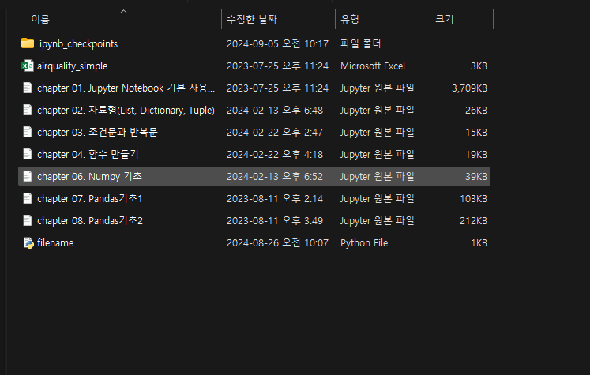

# Python 프로그래밍&라이브러리1

Created: September 5, 2024 9:29 AM
AI summary: 이 문서는 Python 프로그래밍에 대한 내용을 다루며, Jupyter Notebook 사용법, 자료형(리스트, 딕셔너리, 튜플), 흐름 제어(조건문 및 반복문), 함수 생성 및 활용, 그리고 예외처리에 대한 기본적인 설명과 예제를 포함하고 있습니다.

## Chapter 1. Jupyter notebook

1. C드라이브\사용자\사용자명 내 P1 폴더 생성
2. 실습자료 P1폴더로 복사



1. anaconda prompt 실행하여 p1폴더로 이동
2. jupyter labs 실행


### Jupyter Notebook 기본 사용법

셀 실행 단축키

- Alt + Enter :  실행+셀 생성
- Ctrl + Enter : 실행
- Shift + Enter : 실행 + 아래 셀로 이동

(되돌리기는 ‘Z’ 누르기)

셀 생성 및 삭제 단축키

(셀 선택 후)

- 위에 셀 생성 : a
- 아래에 셀 생성 : b
- 삭제는 : dd

셀 전환 단축키

- 마크다운으로 전환 : m
- 코드셀로 전환 : y

코드셀

여러 줄 주석처리 : 스크롤 후 ctrl+/

## Chapter 2. 자료형(List, Dictionary, Tuple)

### 리스트(list)

```python
# 리스트 생성하기
list_a = [ 1, 2, 3, 4, 5 ]
list_b = ['a','b','c','d','e']

# 전체 조회
print(list_a)
print(list_b)
```

print()↔display() 서로 대체 가능함

- range함수
    
    문법 : range(시작값, 끝값, 증가값)
    
    사용법 : list(range(시작값, 끝값, 증가값))
    
      → 단일로 사용하면 그냥 정의만 가지고 출력됨(range(시작값, 끝값, 증가값))
    
     
    

1. 리스트 조회
- 인덱스 조회
    - 리스트명[인덱스]
    
- 범위로 조회
    - 리스트명[시작 인덱스:끝 인덱스] : 시작 ≤  < 끝
    - 시작 인덱스 생략 : 처음부터
    - 끝 인덱스 생략 : 끝까지

1. 리스트 수정
- 값 추가
    - 리스트명.append()
    - 리스트명+[추가값]
    - 리스트명 + 리스트명

- 값 수정
    - 리스트명[인덱스]=수정값

- 값 삭제
    - del 리스트명[인덱스]
    - 리스트.remove[삭제값]

- 함수
    
    len(리스트명) : 리스트 값의 개수
    
    sum(리스트명) : 리스트 합
    
    type(리스트명) : 자료형의 형태 조회
    

### 딕셔너리(dictionary)

1. 생성
- 딕셔너리명 = {key : value, …} 형태로 선언
    - Value : 다양한 형태의 변수
    - Key : Value 변수의 이름

```python
dict_a = { 'v1' : 32,
           'l1' : [1, 2, 3],
           'd1' : {'a' : 1, 'b' : 2} }
```

- 딕셔너리 정보 조회
    - .keys() : 딕셔너리 key 조회
    - .values() : 딕셔너리 value 조회
    - .items() : key와 value 쌍(tuple) 조회

1. 조회
- 딕셔너리명[키값]

```python
dict_a[v1]
dict_a[l2][:2]
dict_a[d1]['a']
```

1. 수정
- 딕셔너리명[키값]=수정값(추가값)
- 삭제 : del 딕셔너리명[키값]

### 튜플

- 생성 : 튜플명 = (좌표값1, 좌표값2)

## Chapter 3. 흐름 제어(조건문과 반복문)

### Bool 연산자

True/False 결과를 반환하는 연산자

- 비교연산자
    - == : 같은가?
    - ! = : 같지 않은가 ?
- 논리 연산자
    - and : 양쪽 둘다 참 이어야 참
    - or : 둘 중 하나만 참 이어도 참
    - not : 논리 값의 반대

### 조건제어(if문)

if 조건문:

코드 1

→ 조건문이 참(True)이면, 코드1 실행

if 조건문:

코드1

else:

코드2

→ 조건문이 True이면 코드1 실행, 아니면 코드 2 실행

if 조건문1:

코드1

elif 조건문2:

코드2

else:

코드3

→ 조건문1이 True이면 코드1 실행, 아니면 또 조건문2가 True이면 코드 2, 아니면 코드 3 실행

### 반복제어

1. for loop

for 변수 in range():

코드

→ range 내 숫자만큼 코드 반복


** 정식명칭

%> modulo

//> integer division

### while loop

while 조건문 :

코드

**조건변경문**

→ 조건문이 참일 동안 코드 실행 , 조건변경문이 없다면 무한 루프에 빠질 수 있음 !!


while 사용 예시

```python
while True :
    a = input('암호를 입력')
    if a == 'pass' :
        print('Welcome')
        break
```

## Chapter 4. 함수 생성 및 활용

### 함수

- 이미 사용해본 함수들
    - print(), len(), range()
- 메서드(method)
    - 함수의 일종
    - .append(), .insert() …
    - 메서드는 자료형(변수, 리스트, 딕셔너리 등)에 연결해서 사용
- 함수의 구성요소
    - Input: 입력 매개변수, 생략가능
    - 처리 : 코드
    - Output : 실행 결과, 생략가능

### Input

- 함수 생성 시, 매개변수 이름을 쉼표로 구분함
- 함수 사용 시, 입력 매개변수 이름을 지정할 경우 **매개변수 순서와 상관 없음**/ 매개변수 이름을 생략했을 경우 **생성시 정의한 순서대로 입력**해야 함
- 입력 매개변수 이름 앞에 ‘*’을 붙이면 ex) def numbers(*nums) : …

→ 입력 값의 수를 정하지 않고, 사용할 때 들어오는 대로 받음

### Output

- print() : 보여줘 - 화면에 결과 출력
- return() : 돌려줘 - output으로 결과를 내보내고 함수 종료

—> 여러개 Output 일 때 하나만 쓰고 싶다면 _(언더바) 사용

ex) def a (,, ,, ) : return a,b —→  tmp, _ = a(,, ,,)

### 예외처리

- 입력값에 대한 예외처리

```python
type(a) == int

#정수 : int
#실수 : float
#문자열 : str
#리스트 : list
#딕셔너리 : dict
```

- try, except 처리
    - try : 오류를 감지하고자 하는 코드 블럭
    - except : 발생된 오류를 처리

# Python 프로그래밍&라이브러리2

Created: September 6, 2024 10:17 AM
AI summary: No content

## Chapter 5 데이터 구조

데이터 분석의 큰 그림 CRISP-DM → 이후에 자세히 할 것임 !!

### 분석할 수 있는 데이터

- 범주형
    - 질적 데이터(정성적 데이터)
        - 명목형 데이터(성별, 흡연여부..)
        - 순서형 데이터(연령대, 매출등급 ..)
- 수치형
    - 양적 데이터(정량적 데이터)
        - 이산형 데이터(판매량, 나이 ..)
        - 연속형 데이터(온도)

** 데이터 구조를 다루는 패키지

- numpy : 수치 연산
- pandas : 비즈니스 데이터 포현

## Chapter 6 Numpy 기초

### 리스트의 한계

- 수학적 계산이 불가능
- 대량의 데이터를 처리하기 힘듦

### Numpy

- 빠른 수치 계산을 위한 라이브러리
- 벡터와 행렬 연산
- pandas와 matplotlib 기반으로 사용

import numpy → 별칭 없이 라이브러리 불러오기

import numpy as np → 별칭을 주고 라이브러리 불러오기

from numpy import array → 특정 함수만 불러오기

** 용어

- axis : 배열의 각 축
- rank : 축의 개수
- shape : 축의 길이, 배열의 크기

1차원 배열

- [ , , ] 형태 - 1차원 리스트 형태

2차원 배열

- [[ , , ,], [, , ,], , , ] 형태 - 2차원 리스트 형태

3차원 배열

- 3차원 리스트 형태
- 3차원 배열 읽기 (2,3,3) → (3,3) 크기의 2차원 배열이 2개이다 !

### Reshape

- 기존 배열을 새로운 형태의 배열로 다시 구성
- 사용방법
    - 변수명=np.reshape(배열명, (6,1))
    - 변수명 = 배열명.reshape(6,1)
    - 배열명.reshape(6,-1) → 배열을 6행으로 된 배열로 변환, 열의 수는 데이터에 맞게
    - 배열명.reshape(-1,1)) → 배열을 1열로 된 배열로 변환, 행의 수는 데이터에 맞게

- 추가 함수
    
    np.zeros: 0으로 채워진 배열
    
    np.ones(): 1로 채워진 배열
    
    np.full(): 특정 값으로 채워진 배열
    
    np.eye(): 정방향 행렬
    
    np.random.random(): 랜덤 값으로 채운 배열
    
    np.mean() : np의 평균 출력
    

### 배열 데이터 조회

- 요소조회
    - 배열명[행 인덱스, 열 인덱스]
    - 배열명[행 인덱스] [열 인덱스]
- 행 조회
    - 배열명[행 인덱스, :]
    - 배열명[[행1,행2], :]
- 2차원 배열 조회 방법
    - 배열명[시작:끝]
    - 배열명[행인덱스, 시작:끝]
    - 배열명[시작:끝,시작:끝]

```python
a = np.array([[11, 12, 13, 14],
              [15, 16, 17, 18],
              [19, 20, 21, 22]])
       
print(a[:, [2]])
#[[13]
# [17]
# [21]]
print(a[:,2])
#[13 17 21]      
```

→ 결과값이 다르게 나오는 이유 : a[:, [2]]의 경우 열에 대해 []로 인덱싱하고 있어 2차원 배열의 구조가 유지되어 2차원 배열로 반환되고, a[:,2]는 열에 대해 리스트 없이 2로 인덱싱하고 있어 리스트 없이 1차원 배열로 반환됨

### 조건 조회

배열명[조건문]

```python
score= np.array([[78, 91, 84, 89, 93, 65],
                 [82, 87, 96, 79, 91, 73]])
                 
                 
score >= 90
 #array([[False,  True, False, False,  True, False],
 #      [False, False,  True, False,  True, False]])
 
print(score[score >= 90])
 #[91 93 96 91]

condition = score >= 90 # 조건문을 변수로 선언하여 사용 가능
print(score[condition])
 #[91 93 96 91]

print(score[(score >= 90) & (score <= 95)]) # 여러 조건을 &와 |로 연결하여 조회 가능
 #[91 93 91]
```

### 배열 사칙연산

- 더하기 : np.add()
- 빼기 : np.subtract()
- 곱하기 : np.multiply()
- 배열 나누기 : np.divide()
- 지수 연산 : np.power()

### 배열 집계

- np.sum() 또는 array.sum()
    - axis=0 : 열 기준
    - axis=1 : 행 기준
    - 생략시, 전체 집계
    
    ** np.max(), np.mins(), np.mean(), np.std() 모두 동일하게 사용 가능함
    

### 자주 사용되는 함수들

- np.argmax(), np.argmin() : 가장 큰 값 또는 가장 작은 값의 **인덱스** 출력
- np.where

## Chapter 7 판다스(Pandas)1

## 데이터프레임 생성

- 데이터프레임 : 관계형 데이터베이스의 테이블 또는 엑셀 시트와 같은 형태, 2차원 구조

열 - 정보, 변수(feature, target)

행 - 분석 단위, 관측치, 샘플

- 시리즈(Series): 데이터 프레임에서 하나의 열을 떼어낸 것, 1차원 구조

1. pandas 라이브러리 불러오기

import pandas as pd

1. 데이터프레임 만들기

df= pd.DataFrame(딕셔너리명)

- csv파일 읽어오기 : pd.read_csv(csv파일 경로)

## 데이터프레임 탐색

- .head(n) : 앞쪽 n개 데이터 확인
- .tail(n): 뒤쪽 n개 데이터 확인
- .shape : 데이터프레임 모양 확인 - (행수(데이터 개수), 열수(정보 개수)) 형태
- info(): 인덱스, 열, 값 개수, 데이터  형식 정보 등 확인

** 열정보 확인

- data.columns → `Index(['Ozone', 'Solar.R', 'Wind', 'Temp', 'Date'], dtype='object')`
- data.columns.values → `['Ozone' 'Solar.R' 'Wind' 'Temp' 'Date']`
- list(data) → `['Ozone' 'Solar.R' 'Wind' 'Temp' 'Date']`

### 데이터 정렬

- sort_index() : 인덱스 기준으로 정렬
- sort_values(by=) : 해당 열의 값을 기준으로 정렬

## Chapter 8. Pandas 2

- 데이터프레임 : 2차원
- 시리즈 : 1차원

```python
Dataframe['column'] -> 1차원 결과 : 시리즈

Dataframe[['column']] -> 2차원 결과 : 데이터프레임
```

- .loc: df.loc[조건]형태로 조건을 지정해주면 조건에 만족하는 데이터만 출력함
    - 여러 조건을 작성할 경우 → &와 |를 사용, 각 조건은 소괄호로 묶음
    - 특정 열의 모든 행을 가져오려면 → data.loc[ : , [’column1’, ‘column2’]]

- .isin(): 해당되는 값인 데이터 조회
    - data.loc[data[’column1’].isin([’value1’,’value2’])]
    
- between(): 범위 안의 데이터 조회
    - data.loc[data[’column1’].between(1,3)]
        - inclusive = ‘both’(기본값) → ‘left’, ‘right’, ‘neither’
    
    ```python
    #동일 코드
    
    data.loc[data['Age'].between(25, 30, inclusive='left')]
    
    data.loc[(data['Age'] >= 25) & (data['Age'] <= 30)]
    
    ```
    