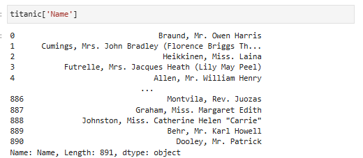

# 데이터처리1

Created: September 9, 2024 9:49 AM
Class: 데이터처리
AI summary: No content

## 복습문제



→ 시리즈(1차원)


→ 데이터프레임(2차원)

조회 시, 대괄호를 두개 사용할 경우 데이터프레임으로 조회 가능

## Chapter 1. 데이터프레임 변경

### 데이터 이름 변경

- 데이터 이름 변경 : rename() or columns로 가능
    - data.columns를 이용할 경우 모든 열의 이름을 다 써야 함(변경 열+변경 X 열)
    - rename()을 이용할 경우 (기존 열이름):(바꿀 열이름)으로 딕셔너리 형식으로 작성해줘야 함
        - inplace=True,False가 있음

### 열 추가

- 열 추가와 같은 경우는 data[’columns1’]=’new data’ 로 만들어주면 됨
- 

### 열 삭제

- drop() 이용
    - axis=0 : 행삭제
    - axis=1 : 열삭제
    - inplace =True, False(실제로 삭제할지, 조회만 할것인지 선택)

### 값 변경

data[’columns1’]=새로운 값

열이름 작성 위치에 조건을 넣어서 사용 가능 또는 np.where() 사용

```python
#loc
data2.loc[data2['Diff_Income'] < 1000, 'Diff_Income' ] = 0

#where
data2['Age'] = np.where(data2['Age'] > 40, 1, 0)
```

map 또는 cut도 사용 가능

```python
#map
data2['Gender'] = data2['Gender'].map({'Male': 1, 'Female': 0})

#cut
age_group = pd.cut(data2['Age'], 3)
```

- cut : 숫자형 → 범주형
    
    지정 개수의 범위로 나누어 줌
    

## Chapter 2. 데이터프레임 결합

### concat()과 merge()

- pd.concat() : 인덱스(행)과 칼럼이름(열)을 기준으로 결합
    - axis로 방향을 정함(0=세로로 합치기, 1=가로로 합치기)
- merge() : 특정 키 값을 기준으로 결합
    - 가로로만 결합 가능
    - inner,outer,left,right 방법이 있음
        - inner : 같은 값만 결합
        - outer : 모두 결합
        - left : 왼쪽 df는 모두, 오른쪽 df는 같은 값만 결합
        - right : 오른쪽 df는 모두, 왼쪽 df는 같은 값만 결합

### pivot

- 결합은 아니지만, 데이터프레임 구조를 변형해서 조회하는데 사용됨
1. groupby로 집계
2. pivot(index, column, value)

## Chapter 3. 시계열 데이터 처리

- 시계열 데이터 : 데이터간에 순서(흐름)이 있고 시간간격이 동일한 데이터를 말함
- dt.날짜요소로 날짜 요소를 뽑을 수 있음


- .shift() : 시계열 데이터에서 시간의 흐름 전후로 정보를 이동시킬 때 사용
- .rolling().mean(): 시간의 흐름에 따라 평균을 이동하면서 구함
- diff(): 이전 데이터와의 차이

# 데이터처리2

Created: September 10, 2024 7:33 PM
Class: 데이터처리
AI summary: No content

## Chapter 04. 데이터분석 방법론

](images/0910/image.png)

출처 : [https://blog.naver.com/pcy7805/223011870957](https://blog.naver.com/pcy7805/223011870957)

Business Understanding : 무엇이 문제인가?

1. 비즈니스 문제 정의
2. 데이터분석 방향, 목표 결정
3. 초기 가설 수립
- 귀무가설과 대립가설로 문제를 정의하고 파악하기 위해서 가설을 수립

Data Understanding 

1. 원본식별
2. 하나의 데이터프레임
3. 데이터분석 EDA & CDA
- EDA(Exploratroy Data Analysis/탐색적 데이터 분석):개별 데이터 분포, 가설 확인
- CDA(Confirmatory Data Analysis/확증적 데이터 분석): 통계적 분석 도구 사용

데이터 분석 순서

1. 단변량 분석 :개별 변수의 분포
2. 이변량 분석 1 : feature(X)와 target(Y) 간의 관계
3. 이변량 분석 2 : feature(X)들 간의 관계

## Chapter 05. 시각화 라이브러리

데이터 파악 방법

- 그래프(시각화) - Historgram, scatter, …
- 통계량(수치화) - 사분위수, 검정 통계량 , p-value, …

파이썬의 시각화 패키지


### Chapter 6. 단변량 분석 - 숫자형

정리하는 방법

1. 기초통계량(df.describe())
    - 평균, 중위수, 최빈값 …
        - 데이터의 분포에 따라 잘못된 대표값이 될 수 있음
    - 사분위수(오름차순으로 정렬해서 전체를 4등분 후 각 경계에 해당되는 값)
        - boxplot으로 시각화 가능

1. 도수분포표
- Histogram(plt.hist(변수명, bins=구간수))
    1. 축의 의미 파악(x축, y축 의미))
    2. 분포 파악(희박 구간, 밀집구간 — 비즈니스 의미 파악)
    3. 왜 그런지 탐구
- 밀도함수(sns.kdeplot(변수명))

### Chapter 7. 단변량 분석 - 범주형

- 범주별 빈도수 - 시리즈.value_counts()
- 범주별 비율 - 시리즈.value_counts(normalize=True)

범주형 변수 시각화

- Bar Plot(sns.countplot/ plt.bar)