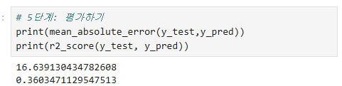
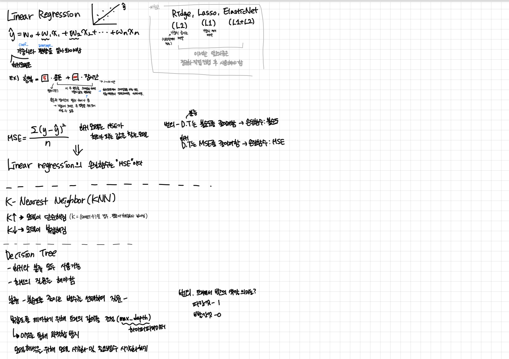
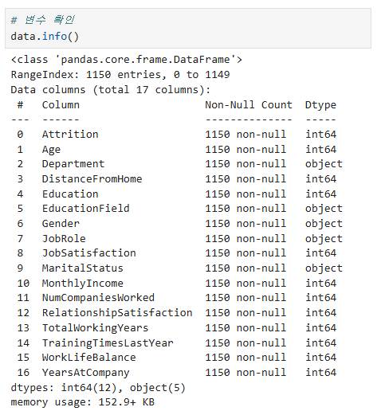

# 머신러닝1

## 머신러닝

### 머신러닝 개념

데이터가 다음과 같을 때

| x | y |
| --- | --- |
| 1 | 3 |
| 2 | 5 |
| 3 | 7 |
| 4 | 9 |

x: 5 인 경우 y의 값이 얼마일까?

기계는 데이터를 기반으로 x와 y 사이의 관계를 파악하여 y가 11이라는 결과를 도출한다.

이러한 과정을 **머신러닝**이라고 함

### 학습 방법에 따른 분류

- 지도 학습 : 정답이 있는 데이터를 기반으로 규칙성(패턴)을 배우게 하는 학습 방법
- 비지도 학습 : 정답이 없는 데이터만으로 배우게 하는 학습 방법
- 강화 학습 : 게임과 같이 선택한 결과에 따라 보상을 받아 행동을 개선하며 배우게 하는 학습 방법

### 과제에 따른 분류

- 분류 문제 : 학습을 통해 찾은 규칙을 기반으로 새로운 데이터를 분류함(지도 학습)
- 회귀 문제 : 학습을 통해 찾은 값의 연관성을 기반으로 새롭게 주어진 데이터에 대한 값을 예측(지도 학습)
- 클러스터링 : 학습을 통해 찾은 분류 규칙을 찾고 새로운 데이터를 분류함- 정답이 없어 성능 평가가 어려움(비지도 학습)

## 분류와 회귀

- 분류 : 범주값 예측 ex) 이동 여부, 교체 여부
- 회귀 : 숫자값 예측 - 중간값이 의미가 있는지, 연산 결과가 의미 있는지… 로 확인 가능 ex) 주가예측, 수요량 예측

분류와 회귀는 서로 다른 함수를 사용하여 모델링 함

→ **문제유형을 정확히 파악**하여 **알고리즘과 평가 방법을 선택**한 후 **관련 함수를 사용해 모델링**해야 함

<aside>
💡

분류 모델로 학습한다면 평가 또한 분류 문제 평가 방법으로 진행해야 함 !!

예측 모델로 학습한다면 평가 또한 예측 문제 평가 방법으로 진행해야 함 !!

</aside>

## 용어 정리

- 모델 : 데이터로부터 패턴을 찾아 수학식으로 정리하는 것
    - 모델링 : 오차가 적은 모델을 만드는 과정
    - 샘플을 가지고 전체를 추정함
        - 샘플 : 표본, 부분집합, 일부, 과거 데이터
        - 전체 : 모집단, 전체집합, 현재와 미래 데이터
        - 추정 : 예측, 추론
- 열 : 특성(feature), 속성(attribute), **변수**(variable), 필드(field)
- 행 : 개체(instance), **관측치**(observed value), 기록(record), 사례(example), 경우(case)
- 독립변수 : 원인(x)
- 종속변수 : 결과(y)
- 평균 : 가장 단순한 모델 - 회귀모델은 평균보다 더 오차가 적은 모델을 만들고 싶어함
- 분류모델의 경우 최반값, 최반값보다 더 오차가 적은 모델을 만들고 싶어함
- 오차 : 실제값과 모델 예측값의 차이, 이탈도
- 데이터 분리 : 데이터 셋을 학습용, 검증용, 평가용 데이터로 분리하여 사용함
- 과대적합 : 학습 데이터에만 성능이 좋은 모델, 평가 데이터에서는 성능이 좋지 않음
- 과소적합 : 학습 데이터와 평가 데이터 모두 성능이 안좋거나, 학습데이터보다 평가 데이터에서 성능이 좋은 경우를 말함

## 실습 : 전처리

- 라이브러리, 데이터 불러오기
    - import 모듈
    - pd.read_csv()를 이용하여 데이터 읽어오기
- 불필요한 변수 제거
    - data.drop(columns=, inplace=True) 를 이용하여 불필요한 열 제거
- NaN 조치
    - NaN 제거
        - data.isna().sum()으로 NaN 개수 확인
        - data.dropna(axis=0, inplace=True) NaN이 포함된 모든 행 제거
        - data.dropna(subset=[’column’], axis =0. inplace=True) column열에 NaN이 포함된 행 제거
        - data.dropna(axis=1, inplace=True) NaN이 포함된 모든 열 제거
    - NaN 채우기
        - 평균값 : data[’column’].fillna(data[’column’].mean(), inplace=True)
        - 최빈값 : data[’column’].value_counts(dropna=True) → data[’column’].fillna('최빈값', inplace=True)
    - 앞/뒤 값으로 채우기
        - 앞의 값으로 채우기 : data[’column’].ffill()
        - 뒤의 값으로 채우기 : data[’column’].bfill()
- 가변수화
    - one-hot encoding을 진행하는 과정 → 변수간 비교우위가 없는데, 컴퓨터가 오해할 수도 있어서 명확하게 변환하는 과정
    - pd.get_dummies이용 : pd.get_dummies(data, columns=[’’,’’, ..], drop_first=True, dtype=int)

## 모델링

### Scikit-Learn

- 지도/비지도 학습 알고리즘을 제공하는 파이썬 라이브러리로 사이킷런이라고 부름
- 모델링 코드 구조
    1. 불러오기 - import
    2. 선언하기 - model = (사용 알고리즘명())
    3. 학습하기 - model.fit(x_train, y_train)
    4. 예측하기 - model.predict(x_test)
    5. 평가하기 - 실제값과 예측값을 평가 함수에 전달하여 성능 평가

### 데이터 준비

- 입력된 데이터에서 찾은 규칙을 기반으로 예측하는 것이므로 좋은 데이터가 좋은 모델을 만듦
- 데이터를 충분히 분석하고 전처리한 후 데이터 분리해야 함

## 실습 : 데이터 분할, 모델링

- 학습용, 평가용 데이터 분할
    - sklearn.model_selection의 train_test_split을 이용
    - 0.3 비율로 나누기 위해 test_size 설정, 동일 결과를 위해 random_state 설정 : train_test_split(x,y,test_size=0.3, random_state=1)
- 모델링
    - 회귀, 분류 먼저 선택 → 이에 따라 알고리즘과 평가방법이 달라짐
        1. 알고리즘과 평가방법 import
        2. 모델 선언 : model.LinearRegression() — 소괄호 중요 !!
        3. 학습하기 : model.fit(x_train, y_train)
        4. 예측하기 : y_pred=model.predict(x_test)
        5. 평가하기 : mean_absolute_error(y_test, y_pred)

# 머신러닝2

## 모델 성능 평가

### 분류 모델 성능 평가

- 분류모델 : 범주형 데이터 예측(0,1)
- 0을 1로 예측하거나 1을 0으로 예측할 수 있음
- 최빈값으로 예측하는 것보다 좋은 성능을 보여줘야 함
- 평가지표
    - Confusion Matrix
        
        
        
        - TN, FP, FN, TP로 나누어짐
            - TN : 음성을 음성으로 예측
            - FP : 음성을 양성으로 예측
            - FN : 양성을 음성으로 예측
            - TP : 양성을 양성으로 예측
    - Accuracy : 전체에서 정확하게 예측한 (TP, TN) 값의 비율
        - $\large Accuracy = \frac{TP+TN}{TP+TN+FP+FN}$
    - Precision : **Positive(양성)으로 예측**한 값(TP, FP) 중 실제 Positive(양성)인 값(TP)의 비율 - 예측 관점
        - $\large Precision = \frac{TP}{TP+FP}$
    - Recall : **실제로 Positive(양성)인** 값(FN, TP) 중 Positive(양성)으로 예측한 값(TP)의 비율 - 실제 관점
        - $\large Recall = \frac{TP}{TP+FN}$
    - F1-Score : Precision과 Recall의 조화 평균
        - $\large F1 = \frac{2\times Precision\times Recall}{Precision+Recall}$

### 회귀 모델 성능 평가

- 회귀 모델 : 숫자 데이터 예측
- 예측값과 실제값 사이의 오차가 적어야 함
- 평균값보다 좋은 성능을 보여줘야 함
- 평가지표
    - MSE : Mean Squared Error
        - $\large MSE=\frac{1}{n}\sum_{i=1}^{n}(y_{i}-\hat{y}_{i})^2$
    - RMSE : Root Mean Squared Error
        - $\large RMSE=\sqrt{\frac{1}{n}\sum_{i=1}^{n}(y_{i}-\hat{y}_{i})^2}$
    - MAE : Mean Absolute Error
        - $\large MAE=\frac{1}{n}\sum_{i=1}^{n}|y_{i}-\hat{y}_{i}|$
    - MAPE : Mean Absolute Percentage Error
        - $\large MAPE=\frac{1}{n}\sum_{i=1}^{n}\left |\frac{y_{i}-\hat{y}_{i}}{y_{i}}\right |$

## 실습 : 분류 및 회귀 모델 성능 평가

- 평가 지표를 metrics에서 import 해서 y_test, y_pred을 넣어서 실행하면 됨

## 선형회귀

- 선형 회귀 : 회귀식을 찾아가는 과정

데이터가 다음과 같이 있을 때

| x | y |
| --- | --- |
| 1 | 1 |
| 2 | 2 |

x = y 같은 회귀식을 찾아내는 것 

| 시간 | 이동거리 |
| --- | --- |
| 1 | 2 |
| 2 | 2 |
| 3 | 3 |
| 4 | 4 |

| 시간 | 이동거리 |
| --- | --- |
| 5 | ? |

먼저 데이터로 주어진 네 점을 지나는 직선을 찾고, 1차 함수 y=ax + b에서 기울기 a와 y 절편 b를 결정함

y=x함수에 의해 5시간 동안 이동한 거리가 5임을 알 수 있음

위와 같이 모든 점을 완벽히 지나가는 직선을 찾기는 힘듦

→ **최선의 y=ax+b 회귀식**을 찾아야함

최선의 회귀식이란 ?

- 회귀식과 데이터값 간 오차 합이 최소가 되는 모델을 말함
- 오차 합이 최소가 되는 가중치(기울기) 편향(y절편)을 찾는 것

오차합 :  $\large MSE=\frac{1}{n}\sum_{i=1}^{n}(y_{i}-\hat{y}_{i})^2$ 

선형 회귀에는 **단순회귀**와 **다중회귀**가 있음

- 단순회귀: 종속변수에 영향을 미치는 독립변수가 하나인 선형 회귀- x 값 하나로 y값을 설명할 수 있는 경우
- 다중회귀 : 종속변수에 영향을 미치는 독립변수가 여러 개인 경우 - 여러 개의 x 값으로 y 값 설명
- 회귀 계수 확인 (model.coef_, model.intercept_)

## KNN(K-Nearest Neighbor)

knn : 가장 가까운 이웃 K 개 → K개의 최근접 이웃 값을 찾아 그 값들로 새로운 값을 예측하는 알고리즘

- 회귀와 분류 모두 사용함
- K값에 따라 데이터를 다르게 에측하므로 적절한 K 값을 찾는 것이 중요 (튜닝)

데이터 사이의 거리를 구하는 방법은 2가지가 있음

- 유클리드 거리 : 두 점 사이의 거리를 구하는 방법과 비슷(대각선 거리)
- 맨하튼 거리
- 맨하튼 거리는 유클리드 거리보다 항상 크거나 같음

**KNN은 데이터 스케일링이 필요함 !!**

왜냐 ? 데이터 간 거리가 정답값에 영향을 주기 때문 → 변수 x1과 변수 x2의 단위에 차이가 있다면 성능에 영향을 줌

-데이터 스케일링 안했을 때 평가점수

-스케일링 했을 때 평가 점수

## Decision Tree

의사결정나무라고도 함, 스무고개와 비슷하게 질문을 하며 데이터를 분류해 나감

분류와 회귀 모두 사용됨

분석 과정을 실제 눈으로 볼 수 있어서 좋음

하지만 과적합이 되기 쉬움 → 트리깊이를 제한하여 과적합을 방지해야함 (튜닝)

주요 용어

- Root Node:전체 자료를 갖는 시작 마디
- Terminal Node: 자식 마디가 없는 마디(=Leaf Node)
- Depth: 뿌리 마디로부터 끝 마디까지 연결된 마디 수

최종값 선정 방법 !

- 분류 : 마지막 노드에 있는 샘플들의 **최빈값**을 반환
- 회귀 : 마지막 노드에 있는 샘플들의 **평균**을 반환

노드마다 존재하는 **불순도**란 ?

- 노드 내 데이터들의 클래스 분포 , 순도의 반대말
- 지니불순도와 엔트로피가 있음
- 지니불순도 : 순수하게 분류되면 - 0, 완벽하게 섞이면(50:50) - 0.5
- 엔트로피 : 순수하게 분류되면 - 0, 완벽하게 섞이면(50:50) - 1

성능을 위한 튜닝에 사용되는 주요 하이퍼파라미터

- max_depth : 트리의 최대 깊이 조절
- min_samples_split : 노드를 분할하기 위한 최소한의 샘플 개수(기본값 : 2) 값이 작을 수록 계속 나눠짐
- min_samples_leaf : 리프 노드가 되기 위한 최소한의 샘플 수(기본값 : 1)

변수 중요도를 확인하는 방법 : model.feature_importances_

## 이전 내용 정리

## 선형 회귀 모델링

- 확률형 데이터의 선형 회귀 모델링은 어떻게 할까?
- 선형 함수가 아닌 시그모이드 함수로 최적선을 찾음
- 선형 판별식 값이 커지면 1, 작아지면 0에 가까운 값이 됨(threshold = 0.5)

## K-Fold Cross Validation

- 기존 모델들은 학습 1번으로 평가를 진행함
- K-fold cross validation의 경우 평가용 데이터를 제외한 데이터를 k개로 나눠 k-1번 학습 후, 평가 진행
- 모델의 일반화된 성능을 예측할 수 있게 해줌
- 하지만 반복 횟수가 많기에 많은 시간이 소요된다는 단점이 있음

## 하이퍼파라미터 튜닝

사용자가 조작할 수 있는 파라미터로, 모델 성능을 최적화하기 위해 조절함

다양한 시도와, 지식, 경험을 통해 최선의 성능을 찾아가는 단계

- Grid Search: 주어진 범위 내 모든 조합을 찾아보는 것
- Random Search: 주어진 범위 내에서 랜덤으로 추출하여 찾아보는 것

- Decision Tree
    - max_depth: 트리 깊이
    - min_samples_leaf: 리프노드의 최소한의 샘플 개수
    - min_samples_split: 분할하기 위한 최소한의 샘플 개수

    ## 데이터 불균형
    
    
    
    → 데이터 변수를 확인했을 때, Dtype에 object가 있을 경우 가변수화를 생각해야 함
    
    데이터의 불균형이 심할 때 바로 모델링하는 경우 결과는 어떻게 나올까 ?
    
    
    
    
    
    → 정확도는 높지만, 1의 recall과 confusion matrix를 보면 정확도를 믿을 수 없다는 것을 알 수 있음
    
    이렇게 클래스 불균형이 있을 때는 어떻게 해야할까? - under sampling 또는 oversampling을 사용해야 함
    
    
    
    
    
    
    
    under sampling 또는 oversampling을 사용한 결과
    
    ## 앙상블(Ensemble)
    
    - 보팅: 여러번 예측 후 결과를 투표하여 예측 결과를 결정하는 방법 (최빈값),
        - 하드보팅 : 가중치 없이 온전히 최빈값으로만 결정
        - 소프트보팅 : 각 모델의 신뢰도를 기반으로 예측결과에 가중치를 두어 예측 결과를 결정
    - 배깅: Random Forest (대표적인 배깅 알고리즘), 여러번 예측 후 그 예측값들을 집계(평균)하여 최종 결과 결정
    - 부스팅: XGBoost, LightGBM과 같은 것들이 있음, 반복적으로 오차를 예측해가며 결과값의 오차를 줄여나감
    - 스태킹