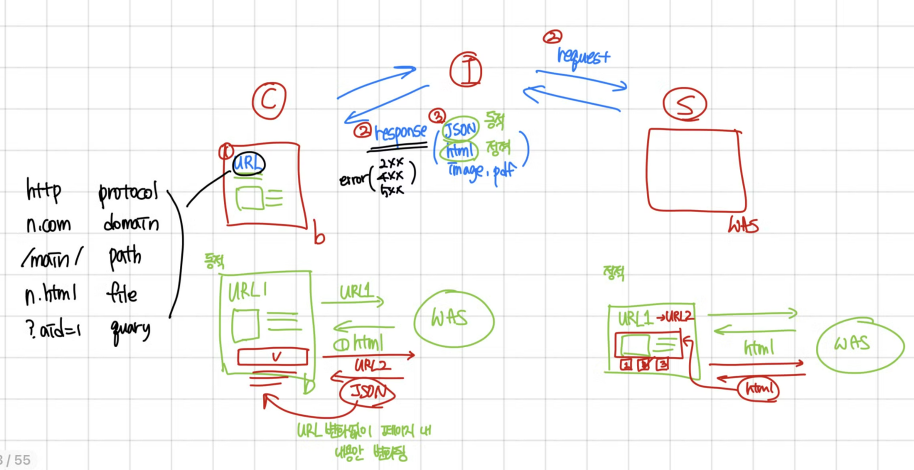
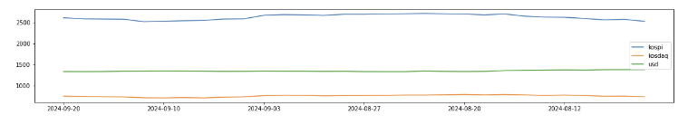
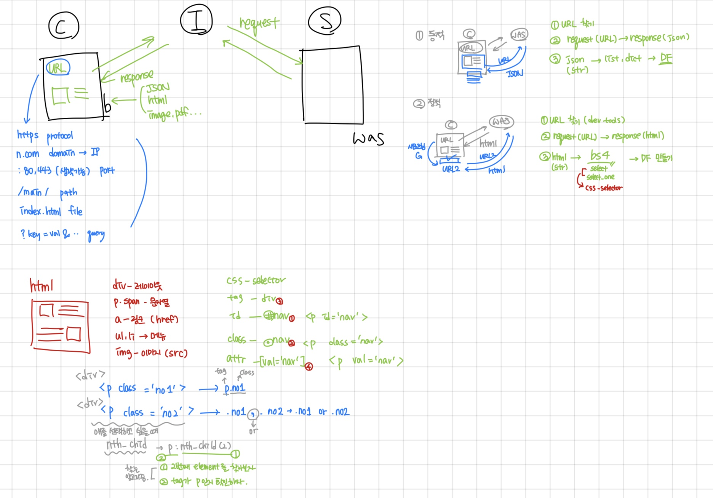

# 웹크롤링1

Created: September 19, 2024 11:55 AM
Class: 웹크롤링
AI summary: No content

## Server & Clinent Architecture

- Client  (Browser) : Server에 데이터 요청(request) - url을 통해 요청
- Server (WAS/DB) : Client에서 데이터를 요청하면 데이터를 Client로 전송(response) - html, json, image, pdf와 같은 데이터 리턴

## URL의 구조

- https or http:// - Protocol
- [naver.com](http://naver.com) - Domain
- :80, 443 - Port
- /main/ - Path
- read.html - file(Page)
- mode=LSD - Query

## 웹페이지의 종류

- 정적 페이지 : URL이 바뀌며 내용이 새로고침 되는 페이지(HTML)
- 동적 페이지: URL이 바뀌지 않으며 내용이 새로고침 되는 페이지(JSON)



요약 정리

### 번외 )

### PYTHON

- 컴퓨터의 CPU, RAM, SSD를 활용하기 위해서 학습
1. 변수선언 : RAM 사용 문법 : 식별자(저장공간을 구분하는 문자열) : PEP20, PEP8(autopep8, flake8)
2. 데이터타입 : RAM 효율적 사용 문법 : int, float, bool, str, list, tuple, dict, set
3. 연산자 : CPU 사용 문법 : 산술, 비교 , 논리, 할당, 멤버 ...
4. 조건문, 반복문 : if, elif, else :
5. 함수 : 반복 사용되는 코드를 묶어서 코드 작성 실행 : def, return, scope(global), lambda
6. 클래스 : 변수, 함수를 묶어서 코드 작성 및 실행 : 객체지향 구현 : class, self, special methods(생성자)
7. 모듈 : 변수, 함수, 클래스를 파일로 묶어서 코드 작성 실행 : 확장자 .py
8. 패키지 : 여러개의 모듈을 디렉토리로 묶어서 관리 : 버전정보 :
9. 입출력 : SSD 사용 문법 : RAM(object) > SSD(file), SSD(file) > RAM(object) : pickle

### Class

- 변수, 함수를 묶어서 코드 작성 실행
- 객체지향 구현 : 실제세계를 모델링하여 프로그램을 개발하는 개발 방법론
- 함수사용: 함수선언(코드작성) > 함수호출(코드실행)
- 클래스 사용
    - 클래스선언(코드작성) > 객체생성(메모리사용) >메서드실행(코드실행)
    - 메서드 : 클래스 안에 선언되는 함수
- class 식별자 : UpperCamelCase, PascalCase(0), snake_case(X:변수, 함수)

예시 ) 입출금

```python
# 1. 클래스선언 : 코드작성
# 예금계좌 : Account : balance, deposit(), withdraw()
class Account:
    balance = 0
    
    def deposit(self, amount):# 입금
        self.balance += amount
    
    def withdraw(self, amount):# 출금
        self.balance -= amount    

# 객체생성 : 메모리사용
acc1 = Account()
acc2 = Account()

# dir() : 객체 안에 들어있는 변수, 함수 목록 출력
dir(acc1)[-3:], dir(acc2)[-3:]

acc1.balance = 1000

# 3. 메서드 실행 : 코드실행
acc1.balance, acc2.balance

acc1.withdraw(600)
acc2.deposit(3000)

acc1.balance, acc2.balance
```

### speical methods

- 특별한 기능을 하는 메서드
- 앞뒤로 '__'가 붙은 메서드
- 대표적으로 생성자 메서드

ex ) 생성자 메서드 : **init**(self) - 특별한 기능 : 객체 실행시 실행되는 메서드

### 실습 : 네이버 주가 데이터 크롤링

naver에서 kospi 데이터를 가져와 그래프 그리기

```python
import requests
import pandas as pd

page_size, page = 60,1
url = f'https://m.stock.naver.com/api/index/KOSPI/price?pageSize={page_size}&page={page}'
url

response = requests.get(url)
response # response 200이 나오는지 확인, 403이나 500이 나오면 수집이 안된 것

response.text[:100] # 수집 데이터 확인

#서버에서 받은 데이터 파싱(데이터 형태를 변경) : json(str) > list, dict > DataFrame
data = response.json()
df = pd.DataFrame(data)
df = df[['localTradedAt', 'closePrice']]
df.tail(2)

```

# 웹크롤링 2

Created: September 23, 2024 11:19 PM
Class: 웹크롤링
AI summary: No content

### 실습 1: 네이버 증권 사이트에서 주가 데이터(kospi, kosdaq, 일별 환율) 수집

1. 데이터 수집

```python
import requests
import pandas as pd

def stock_price(page=1, page_size=60):
    url = f'https://m.stock.naver.com/api/index/KOSPI/price?pageSize={page_size}&page={page}'
    response = requests.get(url)
    data = response.json()
    return pd.DataFrame(data)[['localTradedAt', 'closePrice']]

def stock_price(code='KOSPI', page=1, page_size=60):
    url = f'https://m.stock.naver.com/api/index/{code}/price?pageSize={page_size}&page={page}'
    response = requests.get(url)
    data = response.json()
    return pd.DataFrame(data)[['localTradedAt', 'closePrice']]

def exchange_rate(code='FX_USDKR',page=1,page_size=60):
    url=f'https://m.stock.naver.com/front-api/marketIndex/prices?\
category=exchange&reutersCode={code}W&page={page}&pageSize={page_size}'
    response = requests.get(url)
    data=response.json()['result']
    return pd.DataFrame(data)[['localTradedAt', 'closePrice']]

```

1. 시각화

```python
page_size=30
kp_df = stock_price('KOSPI', page_size=page_size)
kd_df = stock_price('KOSDAQ', page_size=page_size)
usd_df = exchange_rate(page_size=page_size)
kp_df['closePrice']=kp_df['closePrice'].apply(lambda data: float(data.replace(',', '')))
kd_df['closePrice']=kd_df['closePrice'].apply(lambda data: float(data.replace(',', '')))
usd_df['closePrice']=usd_df['closePrice'].apply(lambda data: float(data.replace(',', '')))

import matplotlib.pyplot as plt

plt.figure(figsize=(20,3))
plt.plot(kp_df['localTradedAt'], kp_df['closePrice'], label='kospi')
plt.plot(kd_df['localTradedAt'], kd_df['closePrice'], label='kosdaq')
plt.plot(usd_df['localTradedAt'], usd_df['closePrice'], label='usd')
plt.xticks(kp_df['localTradedAt'][::5])
plt.legend()
plt.show()

```



1. 데이터 스케일링(min max scaling)

```python
from sklearn.preprocessing import minmax_scale

minmax_scale(kp_df['closePrice'])

plt.figure(figsize=(20,3))
plt.plot(kp_df['localTradedAt'], minmax_scale(kp_df['closePrice']), label='kospi')
plt.plot(kd_df['localTradedAt'], minmax_scale(kd_df['closePrice']), label='kosdaq')
plt.plot(usd_df['localTradedAt'], minmax_scale(usd_df['closePrice']), label='usd')
plt.xticks(kp_df['localTradedAt'][::5])
plt.legend()
plt.show()
```


### 실습 2 : header 설정


개발자 도구 - 네트워크에서 헤더 확인 후 헤더 설정

```python
headers = {'user-agent': 'Mozilla/5.0 (Windows NT 10.0; Win64; x64) AppleWebKit/537.36 (KHTML, like Gecko) Chrome/128.0.0.0 Safari/537.36', 
           'referer' : 'https://finance.daum.net/exchanges'}
```

```python
response = requests.get(url, headers=headers)
response

data= response.json()['data']
df = pd.DataFrame(data)[['currencyCode','currencyName','country','basePrice']]
df.tail(3)
```

### 실습 3 : Rest API 이용하여 크롤링

- naver lab의 API를 가져와 크롤링 실습
• [`https://developers.naver.com`](https://datalab.naver.com/keyword/trendSearch.naver)
- client 아이디와 비밀번호를 받아와서 사용

```python
CLIENT_ID, CLIENT_SECRET= XXX, XXX

url= 'https://openapi.naver.com/v1/datalab/search'

#트위터, 페이스북, 인스타그램의 사용량 확인
params = {
    'startDate' : '2018-01-01', 'endDate' : '2023-12-31', 'timeUnit' : 'month',
    'keywordGroups': [{'groupName':'트위터', 'keywords':['트위터', '트윗']},
                      {'groupName':'페이스북', 'keywords':['페이스북', '페북']},
                      {'groupName':'인스타그램', 'keywords':['인스타그램', '인스타']}
    ]
}

headers={
    'Content-Type': 'application/json',
    'X-Naver-Client-Id': CLIENT_ID,
    'X-Naver-Client-Secret': CLIENT_SECRET
}

response = requests.post(url, data=json.dumps(params), headers=headers)
response

data=response.json()['results']
data

dfs=[]
for row in data:
    df = pd.DataFrame(row['data'])
    df['title']=row['title']
    dfs.append(df)
    
len(dfs), dfs

result = pd.concat(dfs, ignore_index=True)
result.tail(2)

pivot_df=result.pivot(index='period', columns='title', values='ratio')
pivot_df.columns = ['instagram', 'twitter', 'facebook']
pivot_df.tail(2)

pivot_df.plot(figsize=(20,5))
```

### 실습 4: 직방 원룸 데이터 수집

- 동이름으로 위도 경도 구하기

```python
addr='망원동'
url = f'https://apis.zigbang.com/v2/search?leaseYn=N&q={addr}&serviceType=원룸'
response = requests.get(url)
data=response.json()['items'][0]
lat, lng = data['lat'], data['lng']
lat, lng
```

- 위도 경도로 geohash 알아내기

```python

!pip install geohash2

import geohash2

geohash = geohash2.encode(lat, lng, precision=5)
geohash

```

- geohash로 매물 아이디 가져오기

```python
url=f'https://apis.zigbang.com/v2/items/oneroom?geohash={geohash}&depositMin=0&rentMin=0&salesTypes[0]=전세&salesTypes[1]=월세&domain=zigbang&checkAnyItemWithoutFilter=true'
response = requests.get(url)
item_ids = [data['itemId'] for data in response.json()['items']]
len(item_ids), item_ids[:5]
```

- 매물 아이디로 매물 정보 가져오기

```python
url='https://apis.zigbang.com/v2/items/list'
parmas = {'domain' : "zigbang", 'item_ids' : item_ids}
response = requests.post(url, parmas)
response

pd.options.display.max_columns =40 

data = response.json()['items']
df = pd.DataFrame(data)
df = df[df['address1'].str.contains(addr)].reset_index(drop=True)
df = df[['item_id', 'sales_title', 'deposit', 'rent', 'size_m2', 'floor', 'building_floor', 'title' ,
        'manage_cost', 'address1']]
df.tail(1)
```

- process를 하나의 함수로 합치기

```python
def oneroom(addr):
    url = f'https://apis.zigbang.com/v2/search?leaseYn=N&q={addr}&serviceType=원룸'
    response = requests.get(url)
    data=response.json()['items'][0]
    lat, lng = data['lat'], data['lng']

    geohash = geohash2.encode(lat, lng, precision=5)

    url=f'https://apis.zigbang.com/v2/items/oneroom?geohash={geohash}&depositMin=0&rentMin=0&salesTypes[0]=전세&salesTypes[1]=월세&domain=zigbang&checkAnyItemWithoutFilter=true'
    response = requests.get(url)
    item_ids = [data['itemId'] for data in response.json()['items']]

    url='https://apis.zigbang.com/v2/items/list'
    parmas = {'domain' : "zigbang", 'item_ids' : item_ids}
    response = requests.post(url, parmas)
    data = response.json()['items']
    df = pd.DataFrame(data)
    df = df[df['address1'].str.contains(addr)].reset_index(drop=True)
    return df[['item_id', 'sales_title', 'deposit', 'rent', 'size_m2', 'floor', 'building_floor', 'title' ,
        'manage_cost', 'address1']]
```

## HTML 기초

- HTML : 웹 문서를 작성하는 마크업 언어
- DOCTYPE
    - 문서의 종류를 선언하는 태그
- html
    - head
        - meta
            - 웹페이지에 대한 정보
        - title
            - 웹페이지의 제목 정보
    - body
        - 화면을 구성하는 엘리먼트
        - 

<!-- HTML 웹문서의 기본적인 구조 -->
<!DOCTYPE html>
<html lang="en">
<head>

<meta charset="utf-8">
<title></title>

</head>

<body>

</body>

</html>

### HTML 태그

- head : title, h1~h6까지 종류가 있음 - 숫자가 커질 수록 문자의 크기가 작아짐 (md의 #,##,###와 비슷한 듯?)
- p : 한 줄의 문자열 출력
- span : 한 블럭의 문자열 출력
- pre : 줄바꿈 또는 띄어쓰기 적용 가능
- div : 레이아웃
- table : 표 만들기
- ul, li : 리스트 표현
- a : href 속성을 이용해서 url을 넣음
- img : src 속성을 이용해서 이미지

— summary —

div : 레이아웃
h1~6 : 제목 문자열 출력
p : 한줄 문자열 출력
span : 한 블럭 문자열 출력
ul li : 메뉴 목록 출력
a : 페이지 이동 : href(url)
img : 이미지 출력 : src(url)

### 실습 5 : 주제어 수집(정적 페이지)

- beauutifulSoup(bs4) 이용하여 html 데이터 parsing
- chrome의 selector 복사를 이용하여 손쉽게 css-select 확인

```python
import pandas as pd
import requests
from bs4 import BeautifulSoup

url = 'https://search.naver.com/search.naver?query=삼성전자'

response = requests.get(url)
response.text[:100]

dom=BeautifulSoup(response.text, 'html.parser')

#select > list, select_one > Tag

elements = dom.select('.fds-refine-query-grid span')
```

# 웹크롤링3

Created: September 23, 2024 10:54 PM
Class: 웹크롤링
AI summary: No content

### 지난 내용 정리



### 실습 1 : 네이버 주식 - 종복분석 리포트 크롤링(정적)

```python
import requests
import pandas as pd
from bs4 import BeautifulSoup

# 1. URL
url = 'https://finance.naver.com/research/company_list.naver?&page=1'

# 2. request(URL) > response(HTML)
response = requests.get(url)
response
response.text[:200] # 수집데이터 확인

# 3. HTML > BeautifulSoup > css-selector > DataFrame
dom = BeautifulSoup(response.content, 'html.parser')
type(dom) # select(css-selector), select_one()

selector='table.type_1 > tr' # chrome selector 복사를 믿으면 안됨, 실제 코드와 selector 복사가 달라 코드가 작동하지 않는 경우가 있음
elements = dom.select(selector)
len(elements)

element = elements[2]
tag=element.select('td')
len(tag), tag # 실제 html tag 확인

# 확인된 tag 기반 데이터 수집
data={}
data['stock_name'] = tag[0].select_one('a').text
data['stock_link'] = tag[0].select_one('a').get('href')
data['title'] = tag[1].select_one('a').text
data['title_link'] = tag[1].select_one('a').get('href')
data['writer'] = tag[2].text
data['pdf_link'] = tag[3].select_one('a').get('href')
data['date'] = tag[4].text
data['pv'] = tag[5].text
data

# for문으로 데이터 수집
rows=[]
for index, element in enumerate(elements) :
    tag=element.select('td')
    #print(index,len(tag))
    if len(tag)==6:
        data={}
        data['stock_name'] = tag[0].select_one('a').text
        data['stock_link'] = tag[0].select_one('a').get('href')
        data['title'] = tag[1].select_one('a').text
        data['title_link'] = tag[1].select_one('a').get('href')
        data['writer'] = tag[2].text
        data['pdf_link'] = tag[3].select_one('a').get('href')
        data['date'] = tag[4].text
        data['pv'] = tag[5].text
        rows.append(data)
    #print(rows)

# 수집된 데이터 파일로 저장 (os 활용)
# os package : 파일 시스템을 관리하는 파이썬 패키지
import os

path = 'reports'
os.path.exists(path)

#파일이 존재하지 않으면 파일 생성
if not os.path.exists(path):
    os.makedirs(path)
    
# 1. url
title = df.loc[0, 'title']
pdf_link = df.loc[0, 'pdf_link']
title, pdf_link

# 2.request(url) > response(pdf)
response = requests.get(pdf_link)
response

# 3. pdf > save(/reports)
filename = f'{path}/{title}.pdf'
print(filename)
with open(filename, 'wb') as file:
    file.write(response.content)

# pickle : RAM >SSD : SSD > RAM

import shutil

shutil.rmtree(path)
#os.path.exists(path)
os.makedirs(path)

for idx, row in df.iterrows():
    #print(idx, row['title'], row['pdf_link'])
    title, pdf_link = row['title'], row['pdf_link']
    response = requests.get(pdf_link)
    filename = f'{path}/{title}.pdf'
    with open(filename, 'wb') as file:
        file.write(response.content)

os.listdir(path)
```

### 실습 3: selenium

- `https://www.selenium.dev`
- 자동화를 목적으로 만들어진 다양한 브라우져와 언어를 지원하는 라이브러리
- chrome 웹 드라이버 설치 필수

** 다음 검색

```python
import pandas as pd
from selenium import webdriver
from selenium.webdriver.common.by import By

driver = webdriver.Chrome()

!pip install webdriver_manager
from selenium.webdriver.chrome.service import Service
from webdriver_manager.chrome import ChromeDriverManager

driver=webdriver.Chrome()

#페이지 이동
driver.get('https://daum.net')

#브라우저 사이즈 조절
driver.set_window_size(900,1000)

#자바스크립트 코드 실행
driver.execute_script('alert("hello selenium!");')
# 오류가 남
#UnexpectedAlertPresentException: Alert Text: hello selenum!
#Message: unexpected alert open: {Alert text : hello selenum!}
# 해결 못함 ㅠㅠ

#검색어 입력 후 검색버튼 클릭 - #q
driver.find_element(By.CSS_SELECTOR, '#q').send_keys('selenium')

# 검색버튼 클릭 - .btn_ksearch
driver.find_element(By.CSS_SELECTOR, '.btn_ksearch').click()

#브라우저 종료 : 자원(RAM)반환
driver.quit()
```

** TED talks 문자열 수집

```python
import time

driver = webdriver.Chrome()
driver.get("https://www.ted.com/talks")

time.sleep(1)
driver.find_element(By.CSS_SELECTOR, '#close-pc-btn-handler').click()

driver.find_element(By.CSS_SELECTOR, 'h2.text-textPrimary-onLight').text

driver.quit()
```

** Headless - 브라우저 화면을 생성하지 않고 메모리상에서만 크롤링, linux에서 사용 가능

```python
options=webdriver.ChromeOptions()
options.add_argument('headless') #headless 

driver = webdriver.Chrome(options=options)
driver.get("https://www.ted.com/talks")

time.sleep(1)
driver.find_element(By.CSS_SELECTOR, '#close-pc-btn-handler').click()
text=driver.find_element(By.CSS_SELECTOR, 'h2.text-textPrimary-onLight').text

print(text)

driver.quit()
```

### xpath 문법

- scrapy 에서  xpath를 사용
- // : 최상위 엘리먼트
- \* : 모든 하위 엘리먼트 : css selector의 한칸띄우기와 같다.
- [@id="value"] : 속성값 선택
- / : 한단계 하위 엘리먼트 : css selector의 >와 같다.
- [n] : nth-child(n)

### 실습 3: scrapy

발생 오류 

**`AttributeError**: module 'lib' has no attribute 'X509_V_FLAG_NOTIFY_POLICY'`

openssl 재설치했지만 오류가 해결되지 않음

추후 업데이트

번외 ) yield

여러번 return 할 수 있는 필드

```python
def echo():
    yield 1
    yield 2
    yield 3
```

echo()할 때 마다 다른 값이 출력됨 

3회 이상 호출 시 에러가 남