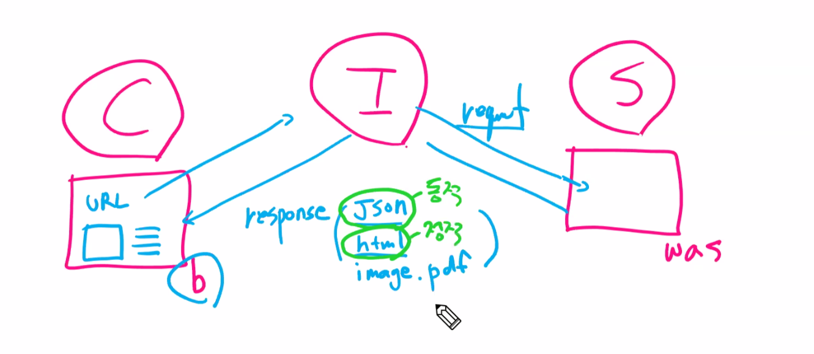

# 웹 기초 지식

## Server & Client Architecture

Client : (request) Browser를 사용하여 Server에 데이터를 요청

Server : (response) Client의 Browser에서 데이터를 요청하면 요청에 따라 데이터를 Client로 전송

## URL

ex) http://naver.com:80/main/read.nhn?mode=LSD&mid=shm#da_727145

- http:// : 프로토콜
- [naver.com](http://naver.com) : 도메인
- 80 : 포트
- /main : path
- read.nhn : 페이지(=파일)
- ?mode=LSD : query
- #da_727145 : fragment

## HTTP Status Code

Client와 Server가 데이터를 주고 받은 결과 정보

- 2xx - Success
- 3xx - Redirect
- 4xx - Request Error
- 5xx - Server Error

## Cookie, Session, Cache

- Cookie : Client의 Browser에 저장하는 문자열 데이터
    - ex) 로그인 정보, 내가 봤던 상품 정보, 팝업 다시보지 않음 등
- Session : Client의 Browser와 Server의 연결 정보
    - ex) 자동 로그인
- Cache : Client, Server의 RAM(메모리)에 저장하는 데이터
    - RAM에 데이터를 저장해서 데이터 입출력이 빠름

## Scraping & Crawling

- Scraping : **특정 데이터**를 수집
- Crawling : 웹서비스의 **여러 페이지를 이동**하며 데이터를 수집

# Web Crawling

## 웹페이지 종류

- 정적 페이지
    - 웹 브라우저에 화면이 한번 뜨면 이벤트에 의한 화면의 변경이 없는 페이지
    - request에 대한 response를 **html** 문자열로 받음
- 동적 페이지
    - 웹 브라우저에 화면이 뜨고 이벤트가 발생하면 서버에서 데이터를 가져와 화면을 변경하는 페이지
    - request에 대한 response를 **json**문자열로 받음

참고 : url 요청 시 가장 처음 받는 response는 정적/동적페이지 모두 html 문자열이다!

## 웹크롤링 방법

1. **requests 이용**
### 동적 페이지
- dev tools로 url 가져오기 → request(url) → response(=json)
- `json → list, dict → DF(data frame)으로 만들기`

### 정적 페이지
- dev tools로 url 가져오기 → request(url) → response(=html)
- `html → bs4(Beautiful Soup 패키지) & css-selector 툴로 필요한 데이터 선택 → list, dict → DF(data frame)으로 만들기`

2. selenium 이용
- 브라우저를 직접 열어서 데이터를 받는 방법

크롤링 방법에 따른 속도

requests json > requests html > selenium